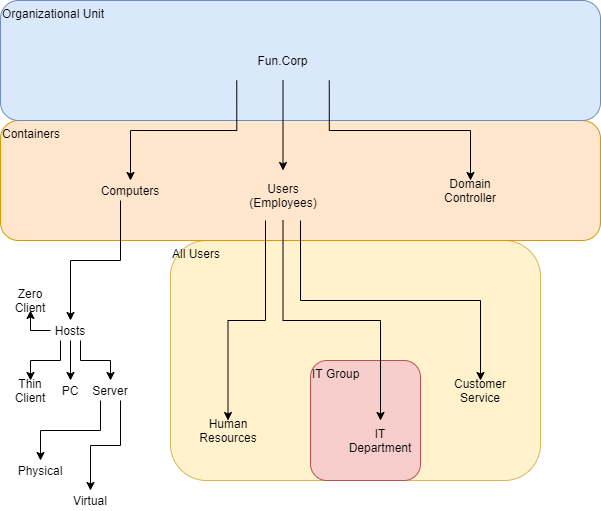

Credentials:
   - URL:       https://cmpt410.ecrl.marist.edu/
   - Username:  administrator@vsphere.local
   - Password:  Password1!

## Windows Server Active Directory Configuration
  - Server Manager -> Manager -> Add Roles and Features
    - Installation Type -> Role-based or feature-based
    - Server Selection -> Chose your server from "Server Pool"
    - Server Roles -> Choose the following from "Roles"
      - "Active Directory Domain Services"
      - "DNS Server"
    - Server Roles -> "Features" -> Remote Server Administration Tools -> Role Administration Tools
      - Make sure all the sub-boxes are checked off
    - Click "Next" through the rest of the menus and click the checkbox to allow for restarts automatically
  - After installation is complete, a flag will appear in the Server Manager -> Dashboard
    - Select the option to "Promote this server to a domain controller"
    - Choose the option "Add a new forest" and specify a root domain name
    - Domain Controller Options:
       - Check "Domain Name Server"
       - Check "Global Catalog"
       - Specify Password: p@ssw0rd123
    - Continue through additional options
    - Begin installation
  - Server Manager -> AD DS -> Right click a server -> choose "Active Directory Users and Computers"
    - Right click the Domain (e.g., "john.craig.io") -> New -> Organizational Unit
    - Can create other stuff under the Organizational Unit, etc.
  - Server Manager -> Dashboard -> Tools -> "Administrator: Active Directory Module for Windows PowerShell"
    - Can execute commands to create policies/network objects, etc.

## Active Directory Notes
**Administration Tools**
 - Active Directory Administrative Center (ADAC)
 - Active Directory Users & Computers (ADUC): where all objects live for users (login accounts); computer/hosts; groups of users or groups of hosts; printers
 - Active Directory Sites & Services (ADSS): configure distribution of information, such as network policies, between different sites
 - Active Directory Domain Trusts (ADDT): allows different companies to communicate information between their networks

**Administrative Center**
Can be used to search Active Directory. Also has a "Recycle Bin", meaning that deleted users/groups can be restored.

**Users & Computers**
Can connect to different domains; can find objects more easily. Can also raise the "functional level", which is dependent upon different versions of the Windows Operating system. The functional level allows access to features available in newer versions of Windows, such as the AD recycle bin, however all computers on the network must be of an appropriate level to accommodate it.

**Sites & Services**
Controls which users can connect to which sites. Also controls how data changes (such as user password changes) or policy changes are proliferated between sites, which site is the center of the network, etc.

**Domain Trusts**
This can create trusts, including:
   - 1 way trusts, where, I.E., user devices trust an administrator devices, and so administrator devices have access to user device files; however user devices cannot access administrator files
      - this is, however, different from actually having the permissions necessary to change to view files
    - 2 way trust; both parties trust one another

**Domain Controller**
Global Catalog: can handle both updates about and proliferation of network information.

Read-Only Domain Controller: meant only for pulling information from, not submitting changes.

**Functional Levels**
 - 2008
 - 2008R2
 - 2012
 - 2012R2
 - 2016

**Domain Hierarchy**
Forest -> Domain -> Subdomain

**Domain Schema**
A schema is a rule about how an object exists within a domain; users, computers, printers, etc. Schemas define what sorts of information is defined about each object, what sorts of information *needs* to be defined, what sorts of information *can* be defined, etc.

**Domain Roles**
Role control which objects-- namely servers or users-- have which privileges/purposes/roles. Roles include:
 - Schema Master
  - defines/modifies schemas
 - Primary Domain Controller (PDC) Emulator
  - handles things like password changes for users
 - Infrastructure Master
  - handles adding more domains to the environment

**Domain Groups**
Types:
 - Universal: can traverse among multiple forests, as long as to any domain, as long as the trusts are in place; this means that a server in the same universal group as another company will be aware of users created on the other company's server (for example)
 - Global: can traverse anywhere within a parent domain
 - Domain Local: can only gain access to the specific domain it was created on

Group Policy: the rules and regulations which control how a computer can behave-- from navigation to different states, downloading or usage of applications. Order of application:
 - Local
 - Site
 - Domain
 - OU
